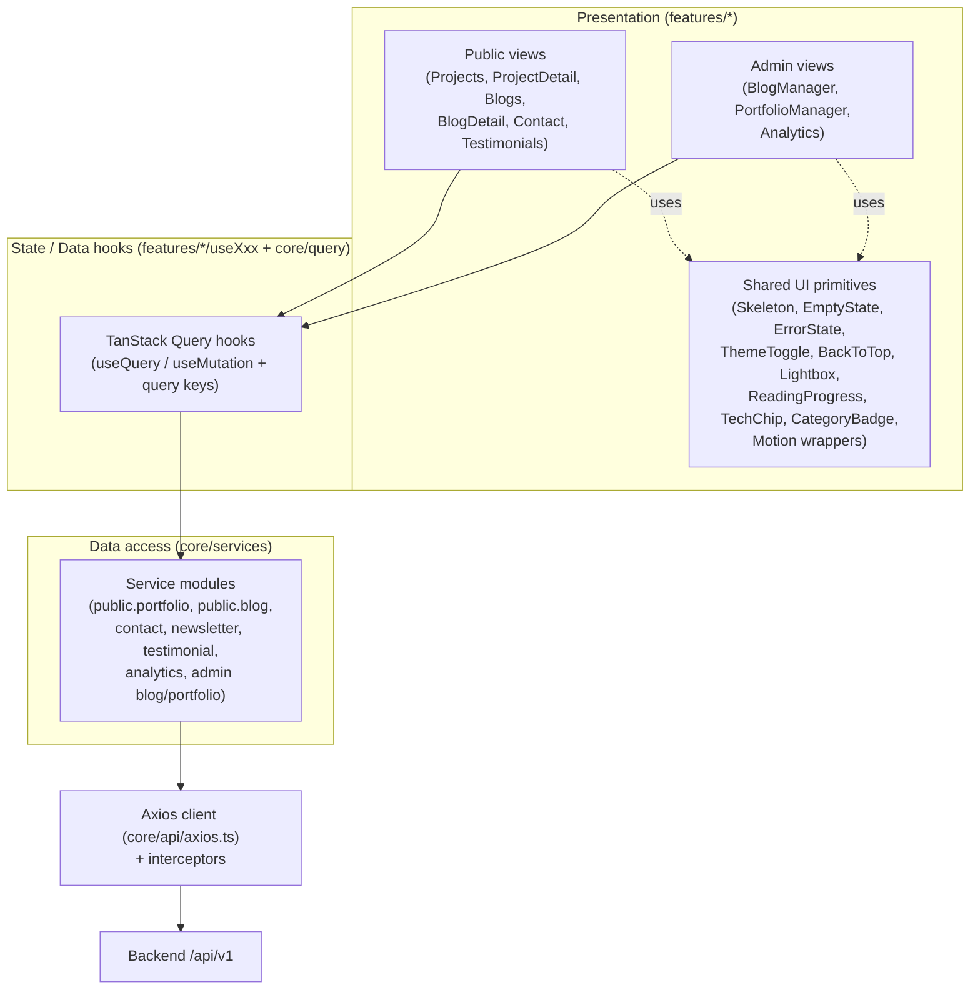
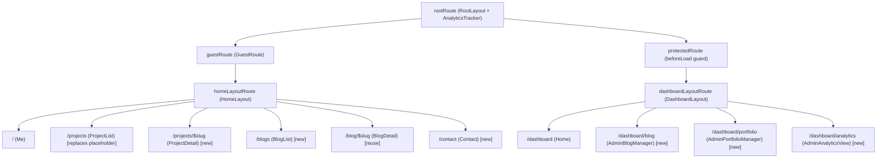

# Design Document: Frontend UI Integration

## Overview

This feature delivers the frontend UI and integration layer that consumes the portfolio
backend (`portfolio-upgrade` spec). It covers the public-facing experience (portfolio
list and case-study detail, blog list and detail with comments/reactions/related posts,
contact form, newsletter, testimonials, dynamic SEO, visit tracking) and the authenticated
dashboard experience (blog and portfolio content management plus an analytics summary),
and layers on visual/experiential polish (theme toggle, motion, skeletons, responsive
navigation, rich media, illustrated empty/error states, accessibility, and consistent
feedback).

The design is deliberately additive: it builds on the conventions already established in
`react-vite-starter` rather than introducing new infrastructure.

- **HTTP**: the shared Axios instance at `src/core/api/axios.ts` (configured with
  `VITE_API_URL` and the auth/refresh interceptors) is the single network entry point.
  Every new service module imports the default `api` export. (Req 13.1)
- **Data fetching**: `@tanstack/react-query` via `QueryClientProvider`
  (`src/core/providers/query-provider.tsx`). Reads use `useQuery`, writes use
  `useMutation` with cache invalidation. (Req 13.1, 13.2)
- **Routing**: TanStack Router with the code-based route tree in
  `src/app/routes/index.tsx`. New public routes mount under `homeLayoutRoute`; new admin
  routes mount under `dashboardLayoutRoute`. (Req 13.8)
- **Forms**: `react-hook-form` + `zod` (via `@hookform/resolvers`) with the existing
  `src/components/ui/form.tsx` primitives. (Req 13.3)
- **Toasts**: `sonner` for all success/failure feedback. (Req 13.4, 21.1)
- **Theme**: the existing `ThemeProvider` (`src/core/providers/theme-provider.tsx`),
  extended to resolve `system` preference from `prefers-color-scheme`. (Req 14)
- **SEO**: the existing `SEO` component (`src/components/shared/SEO.tsx`), extended for
  per-page Open Graph metadata. (Req 9)
- **Analytics**: the existing `AnalyticsTracker` (`src/components/shared/analytics.tsx`),
  extended to also `POST /analytics/visit` while preserving the react-ga4 event. (Req 8)

Each feature continues to follow the established
`features/<Name>/{Component.tsx, useComponent.tsx, index.tsx}` convention, with shared
network code in `core/services` and shared domain types in `core/types`.

### Design Principles

1. **Thin components, logic in hooks.** Each view's data orchestration lives in a
   `useXxx` hook (matching `useBlogs`, `useBlogDetail`), keeping JSX presentational and
   the data/state logic unit-testable.
2. **Pure helpers are extracted.** Query-string building, theme resolution, and
   reading-progress math are pure functions in `core/utils` so they can be property-tested
   independent of the DOM.
3. **Three explicit states everywhere.** Every data-driven view renders explicit
   Loading, Error, and Empty states through shared primitives. (Req 13.5)
4. **Enhancement is non-functional.** The polish layer (Req 14-21) adds no new backend
   calls beyond Req 1-13.

## Architecture

### Layered View



### Data Layer

The data layer is split into two tiers, mirroring the existing `portfolio.service` /
`blogPost.service` style:

1. **Service modules (`core/services`)** — thin wrappers over `api` that return the raw
   Axios response. Each method accepts a typed payload or a query string. New modules:
   - `publicPortfolio.service.ts` — `getPublicList(params)`, `getPublicBySlug(slug)`
   - `blogPost.service.ts` (extend existing) — `getPublicComments(slug)`,
     `createComment(slug, payload)`, `createReaction(slug, payload)`
   - `contact.service.ts` — `submit(payload)`
   - `newsletter.service.ts` — `subscribe(payload)`, `unsubscribe(token)`
   - `testimonial.service.ts` — `getPublic()`
   - `analytics.service.ts` — `recordVisit(payload)`, `getSummary()`, `getAggregations()`
   - `blogCategory.service.ts` / `blogTag.service.ts` — `getAll()` (filter option lists)
   - Existing `dashboard.service.ts` extended/used for admin CRUD where dashboard
     endpoints are preferred (`/dashboard/posts`, `/dashboard/projects`, publish toggles).

2. **Query hooks** — colocated with each feature (`features/<Name>/useXxx.tsx`) and built
   on a shared **query-key registry** so cache invalidation is centralized.

#### Query Key Registry (`core/query/keys.ts`)

A single source of truth for query keys avoids drift between readers and the mutations
that must invalidate them. (Req 13.2)

```ts
export const queryKeys = {
  publicPortfolio: {
    list: (params: PortfolioListParams) => ["public", "portfolio", "list", params] as const,
    detail: (slug: string) => ["public", "portfolio", "detail", slug] as const,
  },
  publicBlog: {
    list: (params: BlogListParams) => ["public", "blog", "list", params] as const,
    detail: (slug: string) => ["public", "blog", "detail", slug] as const,
    comments: (slug: string) => ["public", "blog", "comments", slug] as const,
  },
  testimonials: () => ["public", "testimonials"] as const,
  blogTaxonomy: { categories: () => ["blog", "categories"] as const, tags: () => ["blog", "tags"] as const },
  adminBlog: { list: (params: AdminListParams) => ["admin", "blog", "list", params] as const },
  adminPortfolio: { list: (params: AdminListParams) => ["admin", "portfolio", "list", params] as const },
  analytics: { summary: () => ["admin", "analytics", "summary"] as const, aggregations: () => ["admin", "analytics", "aggregations"] as const },
};
```

#### Cache Invalidation Strategy (Req 13.2)

| Mutation | Invalidates / updates |
|---|---|
| Create/update/delete/publish blog post (admin) | `adminBlog.list` (all), and `publicBlog.list`/`publicBlog.detail` if affected |
| Create/update/delete/publish portfolio project (admin) | `adminPortfolio.list` (all), and `publicPortfolio.*` if affected |
| Submit reaction | optimistic update of `publicBlog.detail(slug)` reaction count; rollback on error (Req 4.6) |
| Submit comment | invalidate `publicBlog.comments(slug)` on success (moderation-aware) |
| Submit contact / newsletter | no cache (write-only); toast + form reset only |

Default query options come from the existing `QueryClient` (`retry: false`,
`refetchOnWindowFocus: false`). List queries pass the params object as part of the key, so
changing a filter/page/search value naturally triggers a new fetch (Req 1.5-1.9,
3.5-3.8).

#### Query Parameter Building

A single pure helper `buildListQuery(params)` (in `core/utils/query.ts`) converts a typed
params object into the query string the backend expects, including CSV joining for `tags`
and `tech` arrays and omission of empty/undefined values. This is the most logic-heavy
pure unit in the feature and is property-tested.

```ts
export interface PortfolioListParams {
  category?: string;
  tags?: string[];     // serialized as CSV: tags=a,b,c
  tech?: string[];     // serialized as CSV: tech=x,y
  search?: string;
  featured?: boolean;
  page?: number;
  limit?: number;
}
// buildListQuery({ category: "web", tags: ["react","ts"], page: 2 })
//   -> "category=web&tags=react,ts&page=2"
```

### Routing Additions (Req 13.8)

All new public routes are children of `homeLayoutRoute` (inside the guest group); all new
admin routes are children of `dashboardLayoutRoute` (inside the protected group). The
existing `projectsRoute` placeholder component is replaced with the real
`ProjectList` feature. The existing `/blog/$slug` route is reused for `BlogDetail`.



New route definitions follow the existing `createRoute` pattern and are added to
`routeTree` under the appropriate `addChildren` call. Search params (filters/pagination)
are read from `location.search` consistent with `useChangeUrl`.

### Shared UI Primitives Layer

New primitives live under `src/components/shared/` (cross-feature) and reuse the existing
`components/ui/*` Radix+Tailwind primitives (notably `skeleton.tsx`, `badge.tsx`,
`dialog.tsx`, `progress.tsx`, `button.tsx`).

| Primitive | Responsibility | Requirements |
|---|---|---|
| `Skeleton` views (`ProjectGridSkeleton`, `BlogListSkeleton`, `BlogDetailSkeleton`, `TestimonialSkeleton`, `TableSkeleton`) | Content-shaped loading placeholders built on `ui/skeleton` | 16.1-16.6 |
| `EmptyState` | Illustration/icon + text, consistent structure, theme-aware | 13.5, 19.1, 19.3, 19.4 |
| `ErrorState` | Illustration/icon + text + retry control, theme-aware | 1.3, 13.5, 19.2-19.4 |
| `ThemeToggle` | Switches dark/light, persists preference, ARIA label | 14.1-14.3, 14.7, 20.3 |
| `BackToTop` | Appears after one viewport of scroll, scrolls to top, ARIA label | 17.5, 17.6, 20.3 |
| `Lightbox` | Gallery overlay with zoom, prev/next, Escape close, focus trap, focus restore, ARIA label | 18.5, 18.6, 20.3-20.5 |
| `ReadingProgress` | Fixed bar reflecting scroll proportion of article content | 18.7 |
| `TechChip` | Tech-stack icon + name | 2.9, 18.4 |
| `CategoryBadge` | Category/tag label built on `ui/badge` | 18.1 |
| `Motion` wrappers (`FadeIn`, `MotionSection`) | framer-motion entrance/transition wrappers that honor `prefers-reduced-motion` | 15.1, 15.4, 15.5 |
| `StickyHeader` | Condensing sticky public header hosting nav + `ThemeToggle` | 14.1, 17.3 |

A `useReducedMotion` hook (wrapping the `prefers-reduced-motion` media query) and a
`useScrollProgress` hook back the motion and progress primitives.

## Components and Interfaces

### Domain Types (`core/types`)

New/extended types model the backend response shape `{ status, message, data, metadata }`
with pagination metadata `{ total, page, limit, totalPages, hasNext, hasPrev }`.

```ts
// core/types/api.type.ts
export interface ApiResponse<T> { status: string; message: string; data: T; metadata?: PaginationMeta; }
export interface PaginationMeta { total: number; page: number; limit: number; totalPages: number; hasNext: boolean; hasPrev: boolean; }

// core/types/portfolio.type.ts (extend IPPortfolio for public case study)
export interface PublicProject extends IPPortfolio {
  problem?: string | null;
  solution?: string | null;
  results?: string | null;
}

// core/types/blogPost.type.ts (extend for public detail)
export interface PublicBlogPost extends IBlogPost {
  category?: BlogCategory | null;
  tags?: BlogTag[];
  reactionCount: number;
  readingTime: number;          // minutes (Reading_Time)
  relatedPosts?: RelatedPost[];
}
export interface RelatedPost { id: string; title: string; slug: string; coverImage?: string | null; }
export interface BlogCategory { id: string; name: string; slug: string; }
export interface BlogTag { id: string; name: string; slug: string; }
export interface BlogComment { id: string; name: string; email?: string; content: string; status: "approved" | "pending"; createdAt: string; }

// core/types/contact.type.ts
export interface ContactPayload { name: string; email: string; subject: string; body: string; }
// core/types/newsletter.type.ts
export interface NewsletterPayload { email: string; }
// core/types/testimonial.type.ts
export interface Testimonial { id: string; author: string; message: string; role?: string | null; avatar?: string | null; }
// core/types/analytics.type.ts
export interface VisitPayload { path: string; }
export interface AnalyticsSummary { totalVisits: number; totalPosts: number; totalProjects: number; [k: string]: number; }
export interface AnalyticsAggregations { topPosts: TopItem[]; topProjects: TopItem[]; }
export interface TopItem { id: string; title: string; slug: string; count: number; }
```

Zod schemas for write forms live alongside these types (extending the existing pattern in
`portfolio.type.ts` / `blogPost.type.ts`): `ContactSchema`, `NewsletterSchema`,
`CommentSchema`, plus extended `CreateBlogPostSchema` (category + tags) and extended
`CreatePortfolioSchema` (problem/solution/results already partially present; gallery +
tech + tags arrays). (Req 13.3, 10.6, 11.7-11.9)

### Public Feature Areas

#### Portfolio List (`features/Me/Projects` → ProjectList) — Req 1, 16.1, 18.1-18.3

- **Component** `ProjectList.tsx`: renders a featured section (always present structurally,
  Req 1.8), a filter bar (category select, tag/tech multi-select, debounced search input),
  the project card grid, and pagination. Renders `ProjectGridSkeleton` while loading,
  `ErrorState` (with retry) on error, `EmptyState` on zero results. Cards use
  `CategoryBadge`, cover-image-with-placeholder, and hover elevation.
- **Hook** `useProjectList.tsx`: reads filter/page/search from router search params,
  debounces search at 400ms (Req 1.7) via the existing `useDebounce`, builds params with
  `buildListQuery`, and calls `useQuery(queryKeys.publicPortfolio.list(params))`. Also
  loads category/tag/tech option lists.
- **Service** `publicPortfolioService.getPublicList(params: string)` →
  `GET /portfolio/public?<params>`.

#### Project Case Study (`features/Me/Projects/Detail` → ProjectDetail) — Req 2, 9.1, 18.4-18.6

- **Component** `ProjectDetail.tsx`: renders title/problem/solution/results, gallery
  ordered by `position` (Req 2.6) feeding the `Lightbox` (Req 18.5-18.6, 20.4-20.5),
  category/tags, tech stack as `TechChip`s (Req 2.9), and external live/repo links with
  `target="_blank" rel="noopener noreferrer"` (Req 2.7-2.8). Distinguishes 404
  (not-found message + back link, Req 2.3) from other errors (`ErrorState` + retry,
  Req 2.4). Sets SEO from project metadata with title/shortDesc fallback (Req 9.1).
- **Hook** `useProjectDetail.tsx`: `useQuery(queryKeys.publicPortfolio.detail(slug))`;
  exposes `isNotFound` derived from a 404 status.
- **Service** `publicPortfolioService.getPublicBySlug(slug)`.

#### Blog List (`features/Me/Blogs` → BlogList) — Req 3, 16.2, 18.1-18.3

Mirrors Portfolio List: category + tag filters, debounced search (400ms), pagination,
card grid with cover/badges/hover elevation, `BlogListSkeleton`, Error/Empty states.
- **Hook** `useBlogList.tsx`: router-search-driven params + `buildListQuery` +
  `useQuery(queryKeys.publicBlog.list(params))`; loads category/tag option lists.
- **Service** `blogPostService.findAllPublic(params)` (existing).

#### Blog Detail (`features/blog/BlogDetail`) — Req 4, 9.2, 16.3, 18.7, 21.2

- **Component** `BlogDetail.tsx` (extend existing): renders title/content/category/tags/
  reading time/view count (Req 4.4), `ReadingProgress` over the article body (Req 18.7),
  the `ReactionControl` (optimistic count + confirmation animation, Req 4.5-4.6, 21.2),
  the approved `CommentList` (Req 4.7), the `CommentForm` (Req 4.8-4.10), and a related
  posts section (Req 4.11). `BlogDetailSkeleton` while loading; not-found message + back
  link on 404 (Req 4.3). Sets SEO from post metadata with title/excerpt fallback (Req 9.2).
- **Hook** `useBlogDetail.tsx` (extend existing): detail query, comments query, reaction
  mutation (optimistic update with rollback), comment mutation (moderation-aware success
  message, Req 4.9).
- **Sub-components**: `ReactionControl`, `CommentList`, `CommentForm` (RHF+zod with
  name/email field validation, Req 4.10).
- **Services**: `getPublicBySlug`, `getPublicComments(slug)`, `createComment(slug, dto)`,
  `createReaction(slug, dto)`.

#### Contact (`features/Me/Contact` → Contact) — Req 5, 21.3

- **Component** `Contact.tsx`: RHF+zod form (name/email/subject/body, Req 5.1-5.2);
  disables submit + shows loading on submit (Req 5.4); success → toast + full reset +
  confirmation animation (Req 5.5, 21.3); error → toast + preserve values (Req 5.6).
- **Hook** `useContact.tsx`: `useMutation` over `contactService.submit`.

#### Newsletter (`features/Me/Newsletter` → NewsletterForm) — Req 6, 21.3

Email input + subscribe control, zod email validation (Req 6.2), success → toast + clear +
confirmation animation, error → toast. Embeddable in footer/sections. Hook wraps
`newsletterService.subscribe`.

#### Testimonials (`features/Me/Testimonials`) — Req 7, 16.4

Mounts → `useQuery(queryKeys.testimonials())`; `TestimonialSkeleton` while loading;
`ErrorState` on error; renders nothing/`EmptyState` on zero without breaking layout
(Req 7.4); renders author + message per item (Req 7.5).

#### Analytics Tracker (`components/shared/analytics.tsx`) — Req 8

Extended so that on `location.pathname` change it both (a) fires the existing react-ga4
`page_view` event (Req 8.3) and (b) calls `analyticsService.recordVisit({ path })`
(Req 8.1). The visit call is wrapped so failures are swallowed silently (Req 8.2) — no
toast, no thrown error. Remains mounted once in `RootLayout`.

#### SEO Manager (`components/shared/SEO.tsx`) — Req 9

Extended to accept optional `image`, `url`, and `type`, and to update on every render so
navigation refreshes title/description/OG tags (Req 9.4). Detail views pass metadata with
documented fallbacks (Req 9.1-9.2); list/static pages pass page-appropriate values
(Req 9.3). (Existing implementation already updates the DOM in a `useEffect` keyed on
props, satisfying the update-on-navigation behavior.)

### Admin Feature Areas

#### Admin Blog Manager (`features/blog-post/BlogPost` → AdminBlogManager) — Req 10, 16.5

- **Component**: `@tanstack/react-table` table of posts (`TableSkeleton` while loading),
  create/edit dialog form (RHF+zod, category + multi-tag assignment via existing
  `searchable-select`/`searchable-mutiple-select`, Req 10.6), delete confirmation dialog,
  publish toggle. Field validation blocks submit on missing required fields (Req 10.7).
  Errors → toast + preserved view state (Req 10.8).
- **Hook**: list query + create/update/delete/publish mutations that invalidate
  `adminBlog.list` and refresh on success (Req 10.2-10.5).
- **Services**: dashboard/blog CRUD (`/dashboard/posts` + `/blog-posts`, publish toggle).

#### Admin Portfolio Manager (`features/portfolio-management/Portfolio` → AdminPortfolioManager) — Req 11, 16.5

Mirrors the blog manager, plus case-study fields (problem/solution/results, Req 11.7), an
ordered gallery editor (add/remove/reorder with URL + position, Req 11.8), and tech-stack +
tags multi-assignment (Req 11.9). The publish toggle re-reads the returned state and, if
the displayed state fails to reflect the API result, treats the operation as failed and
shows an error toast (Req 11.6). Errors → toast + preserved state (Req 11.11).

#### Admin Analytics View (`features/dashboard/Analytics` → AdminAnalyticsView) — Req 12, 16.5

Two queries: `analytics.summary()` and `analytics.aggregations()`. Renders totals
(Req 12.1), aggregations (Req 12.2), and top posts/projects sections (Req 12.5).
`TableSkeleton`/card skeletons while loading (Req 12.3, 16.5); `ErrorState` + retry on
failure (Req 12.4); per-section `EmptyState` when a section returns zero items (Req 12.6).

### Enhancement Design (Req 14-21)

#### Theme (Req 14)
The `ThemeProvider` is extended with a tri-state `Theme_Preference` (`dark` | `light` |
`system`) persisted under a single `localStorage` key (`app-mode`). A pure
`resolveTheme(stored, prefersDark)` helper computes the effective `"dark" | "light"`:
stored explicit value wins; otherwise fall back to the `prefers-color-scheme` result
(Req 14.4-14.5). `ThemeToggle` (in `StickyHeader`, present on all routes, Req 14.1) calls
`setMode`, which applies the `dark` class within the same tick (Req 14.2) and persists the
choice (Req 14.3). The toggle exposes an accessible label naming its action (Req 14.7).
All listed views already consume theme CSS variables, so they render correctly in both
themes (Req 14.6).

#### Motion (Req 15)
`useReducedMotion` reads `prefers-reduced-motion`. `MotionSection`/`FadeIn` apply
framer-motion entrance animations (150-500ms) to primary content on public routes
(Req 15.1, 15.5); when reduced motion is requested they render with animation disabled
(Req 15.4). Hover/focus states are Tailwind utility classes on cards/buttons/links
(Req 15.2-15.3).

#### Skeletons (Req 16)
Content-shaped skeleton components per view replace generic spinners; each view swaps the
skeleton for content/empty/error when its query resolves (Req 16.6).

#### Responsive & Navigation (Req 17)
Shared Tailwind spacing/typography tokens (Req 17.1); mobile-first layouts verified at
360/768/1280 with no horizontal overflow (Req 17.2); `StickyHeader` condenses after 80px
scroll (Req 17.3); in-page anchors use smooth scroll unless reduced motion (Req 17.4);
`BackToTop` appears past one viewport height (Req 17.5) and scrolls to top on activate
(Req 17.6).

#### Visual Richness (Req 18)
Cards render cover image (with placeholder when absent, Req 18.2), title, and category
badges (Req 18.1); hover elevation (Req 18.3); tech chips on the case study (Req 18.4);
`Lightbox` with zoom + adjacent navigation (Req 18.5), Escape/close with focus restore
(Req 18.6); `ReadingProgress` reflects scroll proportion (Req 18.7).

#### Empty/Error States (Req 19)
`EmptyState` and `ErrorState` primitives render icon/illustration + text (+ retry for
errors), with consistent structure across all listed views and theme-aware colors
(Req 19.1-19.4).

#### Accessibility (Req 20)
Visible focus rings via Tailwind `focus-visible` ring utilities (Req 20.1); contrast ≥
4.5:1 enforced by theme tokens (Req 20.2); ARIA labels on `ThemeToggle`/`BackToTop`/
`Lightbox` (Req 20.3); `Lightbox` keyboard operable (Escape close, arrow navigation,
Req 20.4) with focus confined while open (Req 20.5).

#### Feedback & Confirmation (Req 21)
A single `<Toaster>` configuration (position/duration/theme-aware styling) drives all
feedback (Req 21.1, 21.4). Reaction success plays a confirmation animation unless reduced
motion (Req 21.2); contact/comment/newsletter success show a confirmation animation in
addition to the toast unless reduced motion (Req 21.3).

## Correctness Properties

*A property is a characteristic or behavior that should hold true across all valid
executions of a system — essentially, a formal statement about what the system should do.
Properties serve as the bridge between human-readable specifications and machine-verifiable
correctness guarantees.*

This feature is predominantly UI integration (rendering, routing, toasts, animations,
accessibility), which is best validated with example-based component tests and route-tree
assertions. A small set of pure logic/data-transformation units, however, are extracted
into `core/utils` precisely so they can be exhaustively property-tested. The properties
below cover those units. Everything else is routed to the example/integration/smoke tests
described in the Testing Strategy.

### Property 1: List query string builder

*For any* list-params object (any combination of `category`, `tags[]`, `tech[]`, `search`,
`featured`, `page`, `limit`), `buildListQuery` SHALL serialize array fields (`tags`,
`tech`) as comma-separated values, SHALL omit keys whose value is `undefined`, empty
string, or empty array, and SHALL include every present scalar key with its value — such
that parsing the result back yields exactly the non-empty inputs.

**Validates: Requirements 1.5, 1.6, 3.5, 3.6**

### Property 2: Gallery images render ordered by position

*For any* list of project gallery images with arbitrary `position` values and arbitrary
input order, `orderGallery` SHALL return a list sorted by ascending `position` that is a
permutation of the input (same items, same count, none added or dropped).

**Validates: Requirements 2.6**

### Property 3: Gallery position reducer maintains contiguous ordering

*For any* sequence of add, remove, and reorder operations applied to the admin gallery
editor state, the resulting image list SHALL have positions forming a contiguous
`0..n-1` sequence with no gaps and no duplicates, and the item count SHALL equal the
number of items implied by the operations.

**Validates: Requirements 11.8**

### Property 4: Optimistic reaction rollback restores the original count

*For any* starting reaction count, applying the optimistic increment and then applying the
failure rollback SHALL restore exactly the original count.

**Validates: Requirements 4.6**

### Property 5: SEO metadata fallback resolution

*For any* project or post, `resolveSeo` SHALL produce a non-empty title and description:
when explicit metadata (`metaTitle`/`metaDesc` for projects, meta fields for posts) is
present it SHALL use those values, and when explicit metadata is absent it SHALL fall back
to the title and short description/excerpt.

**Validates: Requirements 9.1, 9.2**

### Property 6: Theme preference resolution

*For any* persisted `Theme_Preference` and any `prefers-color-scheme` result,
`resolveTheme(stored, prefersDark)` SHALL return the explicit stored value when the stored
preference is `dark` or `light`, and SHALL otherwise (stored `system` or absent) return the
theme indicated by `prefersDark`.

**Validates: Requirements 14.4, 14.5**

### Property 7: Reading-progress percentage is clamped and monotonic

*For any* scroll position, content height, and viewport height, `readingProgress` SHALL
return a value within the inclusive range `[0, 100]`, and for a fixed content/viewport the
returned value SHALL be non-decreasing as the scroll position increases.

**Validates: Requirements 18.7**

## Error Handling

The error strategy is uniform across the data layer so every view behaves predictably.

- **Network/HTTP errors (reads).** TanStack Query surfaces `isError`; views render the
  shared `ErrorState` with a retry control that calls `refetch()`. (Req 1.3, 3.3, 12.4)
- **Not-found vs other errors (detail views).** Hooks inspect the Axios error status. A
  `404` maps to `isNotFound` → not-found message + back link (Req 2.3, 4.3); any other
  status maps to the generic `ErrorState` + retry (Req 2.4).
- **Mutation errors (writes).** `useMutation.onError` shows a `sonner` error toast and
  preserves the current view/form state (no reset, no navigation). (Req 5.6, 6.5, 10.8,
  11.11)
- **Optimistic mutation rollback.** The reaction mutation snapshots the previous count in
  `onMutate`, applies the optimistic increment, and restores the snapshot in `onError`
  (Property 4). (Req 4.5, 4.6)
- **Publish-toggle display reconciliation.** After a successful publish toggle the manager
  compares the rendered state to the API result; a mismatch is treated as a failure and
  raises an error toast. (Req 11.6)
- **Silent analytics failures.** `analyticsService.recordVisit` is awaited inside a
  `try/catch` that swallows errors; no toast, no thrown error, no console-visible message
  to the visitor. The react-ga4 event is fired independently so a visit failure never
  suppresses it. (Req 8.2, 8.3)
- **Form validation errors.** Caught before any request by the RHF+zod resolver; field
  messages render inline and submission is blocked. (Req 4.10, 5.2, 6.2, 10.7, 11.10)
- **Auth/refresh errors.** Handled by the existing Axios response interceptor (401 →
  refresh → retry, or logout); no per-feature handling required.
- **Global route errors.** The router's existing `ErrorPage` / `NotFound` components
  remain the catch-all for unhandled route-level failures.

## Testing Strategy

Testing reuses the existing harness: **Vitest** with **@testing-library/react** and
**@testing-library/jest-dom** (already in `devDependencies`), run via `npm test`
(`vitest run`). Tests live under `tests/` alongside the existing
`router-migration.test.tsx`. The `@` alias resolves through the existing `vite.config.js`.
A jsdom environment and a Testing Library `jest-dom` setup file are configured for the
component tests.

### Dual approach

- **Property-based tests** verify the seven universal properties above over many generated
  inputs. They target the extracted pure helpers (`core/utils/query.ts`,
  `core/utils/gallery.ts`, `core/utils/seo.ts`, `core/utils/theme.ts`,
  `core/utils/readingProgress.ts`, and the reaction reducer), which have no DOM or network
  dependency and are cheap to run at scale.
- **Example/integration tests** verify concrete UI behavior: rendering of loading/error/
  empty states, debounced search, filter→fetch wiring, navigation targets, form
  validation and submission, toast/feedback, optimistic reaction flow, lightbox keyboard
  operability and focus restore, theme toggle application, skeleton→content swaps, and the
  analytics visit + ga4 dual-fire. These mock the service layer (or the `api` client) and
  use a `QueryClientProvider` test wrapper plus a memory router where routing is involved.
- **Route-tree tests** assert the new public/admin routes exist at the expected
  `fullPath`s under the correct layout groups, following the pattern already established in
  `router-migration.test.tsx`. (Req 13.8)
- **Smoke items** (responsive layout, contrast ≥ 4.5:1, hover elevation, token
  consistency) are validated by manual/visual review and are explicitly out of scope for
  automated unit tests; the design notes them so they are not mistaken for gaps.

### Property-based testing library

The target language is TypeScript and the runner is Vitest, so property tests use
**`fast-check`** (the standard PBT library for the JS/TS ecosystem), added as a
`devDependency`. Property-based testing is NOT implemented from scratch.

- Each property test runs a **minimum of 100 iterations** (`fc.assert(..., { numRuns: 100 })`).
- Each property test is implemented as a **single** property-based test.
- Each test is tagged with a comment referencing its design property in the format:
  **Feature: frontend-ui-integration, Property {number}: {property_text}**

Example tag:

```ts
// Feature: frontend-ui-integration, Property 1: List query string builder
// Validates: Requirements 1.5, 1.6, 3.5, 3.6
import fc from "fast-check";
import { describe, it } from "vitest";
import { buildListQuery } from "@/core/utils/query";

describe("buildListQuery", () => {
  it("serializes arrays as CSV and omits empty values", () => {
    fc.assert(
      fc.property(
        fc.record({
          category: fc.option(fc.string(), { nil: undefined }),
          tags: fc.array(fc.string({ minLength: 1 })),
          tech: fc.array(fc.string({ minLength: 1 })),
          page: fc.option(fc.integer({ min: 1 }), { nil: undefined }),
        }),
        (params) => {
          const qs = buildListQuery(params);
          const parsed = new URLSearchParams(qs);
          // arrays present -> CSV; empty arrays -> omitted; scalars preserved
          if (params.tags.length === 0) expect(parsed.has("tags")).toBe(false);
          else expect(parsed.get("tags")).toBe(params.tags.join(","));
        },
      ),
      { numRuns: 100 },
    );
  });
});
```

### Unit testing balance

Unit/example tests focus on specific scenarios, integration points between hooks and
services, and boundary/error conditions (e.g., sticky-header condense at the 80px
boundary, back-to-top visibility boundary). Broad input coverage is delegated to the
property tests so the example suite stays small and focused.

### Coverage mapping (per requirement)

| Requirements | Test type |
|---|---|
| 1.5, 1.6, 3.5, 3.6 | Property 1 (+ example wiring) |
| 2.6 | Property 2 |
| 11.8 | Property 3 |
| 4.6 | Property 4 |
| 9.1, 9.2 | Property 5 |
| 14.4, 14.5 | Property 6 |
| 18.7 | Property 7 |
| 1.1-1.4, 1.7-1.10, 2.1-2.5, 2.7-2.9, 3.1-3.4, 3.7-3.9, 4.1-4.5, 4.7-4.11, 5.x, 6.x, 7.x, 8.x, 9.3-9.4, 10.x, 11.1-11.7, 11.9-11.11, 12.x, 13.2-13.5, 13.7, 14.1-14.3, 14.7, 15.1, 15.3-15.5, 16.x, 17.4, 17.6, 18.1-18.6, 19.1-19.3, 20.1, 20.3-20.5, 21.1-21.3 | Example/integration (Testing Library) |
| 17.3, 17.5 | Edge-case example (boundary) |
| 13.8 | Route-tree assertion |
| 13.1, 13.6, 14.6, 15.2, 17.1, 17.2, 18.3, 19.4, 20.2, 21.4 | Smoke / manual visual review |
